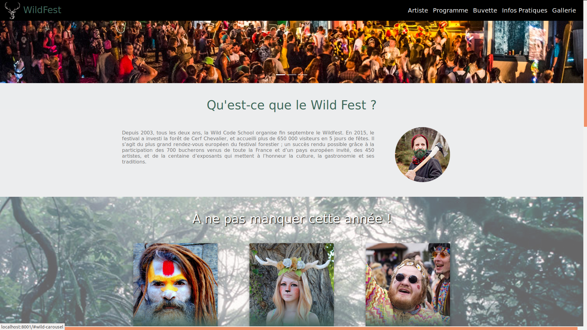

<h1 align="center">Projet fictif n° 1</h1> 
<h2 align="center">Wild festival : Site vitrine du Wild festival</h2> 

<h2>Description</h2>

Le WildFest est un festival alternatif de musique et de performances artistiques. Ce festival se déroule en pleine forêt, au coeur de la nature et proche des animaux. Ce sera notre 4ème édition.

Le wildfest est composé des sections suivantes :

<ul>
  <li>Slider</li>
  <li>Artistes</li>
  <li>Programmation</li>
  <li>Buvette bio</li>
  <li>Gallerie photos</li>
  <li>Infos pratiques</li>
</ul>

<h2>Installation</h2>
<ul>
  <li>Cloner le repository github dans un nouveau dossier</li>
  <li>Faire un pull depuis la branche master</li>
  <li>Créer une connexion en local pour afficher le projet sur le navigateur</li>
</ul>

<h2>Credits</h2>
Ce projet est un travail de groupe dans le cadre de la formation développement web et mobile de la Wild code school Orléans.
Merci à :
<ul>
  <li><a>Mahmoud Alabed</a></li>
  <li><a>Thomas Hubert</a></li>
  <li><a>Arnaud Gauthier</a></li>
</ul>
